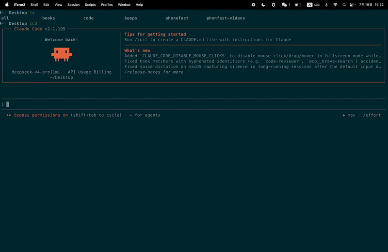

# cc-planet — Flying Banner Notification Tool

Displays an airplane flying across the screen with a trailing banner, designed for CI/CD build status notifications and daily reminders.



## Installation

### Option 1: Install Script (Recommended)

One command to install — always goes to `/usr/local/bin/`.

```bash
curl -fsSL https://raw.githubusercontent.com/gezihua123/cc-planet/main/install_pkg.sh | bash
```

The script will automatically:
1. Detect system architecture (arm64 / x86_64)
2. Download the latest binary from GitHub Releases
3. Install to `/usr/local/bin/`
4. Create a `cc-notify` → `cc-planet` symlink (backward compatibility)
5. Verify the installation

> Installation uses `sudo` to write to `/usr/local/bin/`. Enter your password if prompted.

### Uninstall

```bash
curl -fsSL https://raw.githubusercontent.com/gezihua123/cc-planet/main/install_pkg.sh | bash -s -- --uninstall
```

The uninstall script removes both the `cc-planet` binary and the `cc-notify` symlink.

### Option 2: Manual Download

Go to the [Releases page](https://github.com/gezihua123/cc-planet/releases) and download `cc-planet-*.tar.gz`, then extract and use directly.

### Option 3: Build from Source

```bash
git clone git@github.com:gezihua123/cc-planet.git
cd cc-planet
./build.sh
```

Output: `cc-planet` (Universal Binary, arm64 + x86_64, macOS 11+)

## Quick Start

```bash
# Build
./build.sh

# Run
./cc-planet "Hello World"
./cc-planet --success "Build passed"
```

---

## Usage

```
./cc-planet [--success | --failure | --blocked] [<message>]
./cc-planet --notify <message>
echo '<json>' | ./cc-planet --json
```

### Flags

| Flag | Description |
|------|-------------|
| `--success` | Success status (✅ green theme) |
| `--failure` | Failure status (❌ red theme) |
| `--blocked` | Blocked status (⏳ yellow theme) |
| `--notify <message>` | Notification mode, plain text banner (concurrent-safe) |
| `--json` | Read JSON events from stdin and parse notifications |
| `<message>` | Optional. Text displayed on the airplane banner (max 22 chars) |

### Examples

```bash
# No status, custom message
./cc-planet "Deploying to production"

# Status with default message
./cc-planet --success
# → Banner: "✅ Build passed"

./cc-planet --failure
# → Banner: "❌ Test failed"

./cc-planet --blocked
# → Banner: "⏳ Waiting review"

# Status with custom message
./cc-planet --success "v2.3 deployed"
# → Banner: "✅ v2.3 deployed"

# Notification mode (concurrent-safe, ideal for CI/CD hooks)
./cc-planet --notify "Something happened"

# Parse JSON events (replaces legacy cc-notify)
echo '{"last_assistant_message":"Done","stop_reason":"stop"}' | ./cc-planet --json

# Process AskUserQuestion events
./cc-planet --json < events.json
```

---

## `env.json` Configuration

Customize images, emoji, and default text per status via `env.json`. The program searches for `env.json` in the **current directory** and the **binary's directory** at startup.

### Fields

Each status can be configured with three fields:

| Field | Type | Description |
|-------|------|-------------|
| `image` | string (path) | Airplane PNG path, absolute or relative |
| `emoji` | string | Banner prefix emoji, e.g. `"✅"` |
| `prompt` | string | Default message text for this status |

### Example Config

```json
{
    "default": {
        "image": "/path/to/default-plane.png",
        "emoji": "✈️",
        "prompt": "Hello"
    },
    "success": {
        "image": "/path/to/success-plane.png",
        "emoji": "✅",
        "prompt": "Build passed"
    },
    "failure": {
        "image": "/path/to/failure-plane.png",
        "emoji": "❌",
        "prompt": "Test failed"
    },
    "blocked": {
        "image": "/path/to/blocked-plane.png",
        "emoji": "⏳",
        "prompt": "Waiting review"
    }
}
```

### Message Assembly Rules

```
Final Banner = [Status Emoji] + [Custom Message | Status Default Prompt]
```

- `--success` + custom message → `"✅ Deployed to prod"`
- `--success` + no custom message → `"✅ Build passed"` (uses `prompt`)
- No emoji configured → banner shows no emoji

### Legacy Format Compatibility

`env.json` supports legacy string-only format:

```json
{
    "success": "/path/to/success-plane.png",
    "failure": "/path/to/failure-plane.png"
}
```

### Image Load Priority

```
Status-specific image → default image → top-level image (legacy) → Built-in compiled image
```

### Search Paths

`env.json` search order (first found wins):

1. Process current working directory (`FileManager.currentDirectoryPath`)
2. Executable directory (parent of `argv[0]`)

---

## CI/CD Integration

### GitHub Actions

```yaml
- name: Build & Notify
  run: |
    ./cc-planet --success "Build #${GITHUB_RUN_NUMBER} passed"
```

### Custom Build Script

```bash
#!/bin/bash
if ./build.sh; then
    ./cc-planet --success "Build OK"
else
    ./cc-planet --failure "Build failed"
fi
```

### Claude Code Integration

Get notified when a Claude Code session finishes:

```bash
echo '{"last_assistant_message":"Task complete","stop_reason":"stop"}' | ./cc-planet --json
```

---

## cc-notify Symbolic Link

`cc-notify` is a symbolic link to `cc-planet` (created automatically during installation), providing backward compatibility for legacy hook calls.

```bash
cc-notify "Deploying to production"
cc-notify --success "Build passed"
echo '{"last_assistant_message":"Hello"}' | cc-notify --json
```

> **Fully equivalent to** `cc-planet --notify "..."` / `cc-planet --json`

### Environment Variables

| Variable | Description |
|----------|-------------|
| `CC_PLANET_BIN` | Path to the cc-planet binary |

---

## Building

```bash
./build.sh
```

Output: `cc-planet` (Universal Binary, arm64 + x86_64, macOS 11+)

### Dependencies

- macOS 11+
- Swift (compile-time only, not required at runtime)

---

## Release

```bash
# Patch version bump (default)
./release.sh

# Minor version bump
./release.sh minor

# Major version bump
./release.sh major
```

Release workflow: Build → Package → Tag → Push GitHub Release → Update install_pkg.sh

---

## Development

### Project Structure

```
├── main.swift         # Main program (built-in image + notification event handling)
├── build.sh           # Build script
├── release.sh         # Release script (build → package → push GitHub Release)
├── install_pkg.sh     # Install/uninstall script (download from GitHub Release)
├── env.json           # Runtime config template
├── plane.png          # Source airplane image
├── version.properties # Version configuration
├── README.md          # English documentation (primary)
├── readme_zh.md       # Chinese documentation
└── SKILL.md           # Claude Code skill description
```

### Adding a New Status

1. Add a new field to `EnvConfig` (e.g., `pending`)
2. Add a case in `subscript(status:)`
3. Add the corresponding flag to the `statusFlags` set in CLI parsing
4. Add the config group to `env.json`

---

## License

MIT
